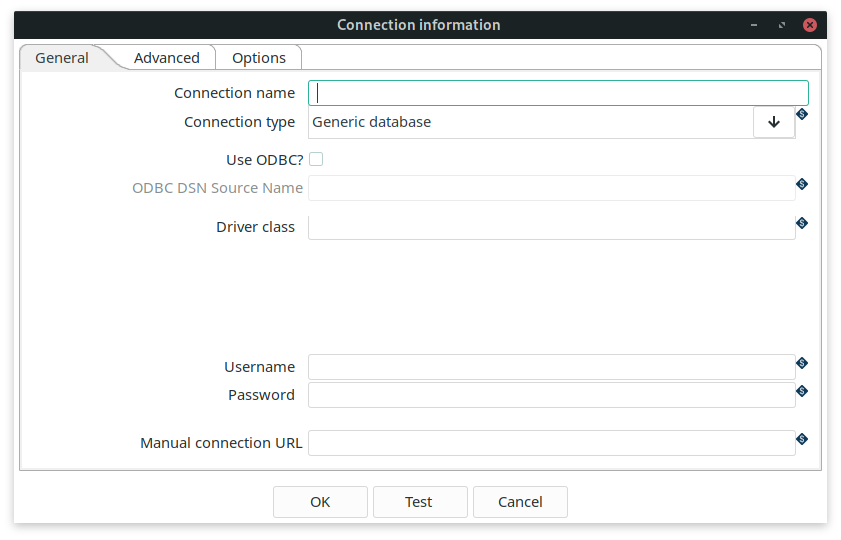

<div id="header">

# Database Plugins

</div>

<div id="content">

<div id="preamble">

<div class="sectionbody">

<div class="paragraph">

Apache Hop has optimized support for many database types. If you are using an unsupported database, you can always create a generic connection.

</div>

<div class="paragraph">

To create a database connection go to the metadata perspective, right-click on `Relational Database Connections` and select `New`.

</div>

<div class="paragraph">

The connection is saved in a central location and can then be used by all pipelines and workflows. If you have set your project to work with Hop, the database information will be in the `${PROJECT_HOME}/metadata/rdbms` folder. For each connection, separate a .json file will be generated in this folder. This json file will have the name of the connection and will contain all of the connection information.

</div>

</div>

</div>

<div class="sect1">

## Adding JDBC drivers

<div class="sectionbody">

<div class="paragraph">

Apache Hop includes JDBC drivers for all databases that provide their drivers under a license that is compatible with the Apache Public License. All JDBC drivers that come with Apache Hop can be found in `lib/jdbc` in your Apache Hop installation folder.

</div>

<div class="paragraph">

The documentation for the various database types in following subsections will show you whether the driver for your database is included. If it included, the connection editor will also show the version of the installed driver. If the driver isn’t included, the documentation will guide you to the download location.

</div>

<div class="paragraph">

Set the `HOP_SHARED_JDBC_FOLDERS` environment variable to a folder that contains your additional JDBC folders. Having them in a central folder helps you to easily upgrade or change your Apache Hop installation, without the need to add your JDBC drivers every time. This variable accepts a comma separated list to point to multiple directories the default value when not set is `lib/jdbc`, e.g. `<PATH_TO_YOUR_HOP_INSTALLATION>/lib/jdbc,<PATH_TO_YOUR_JDBC_FOLDER>`.

</div>

<div class="paragraph">

To avoid conflicts, make sure you only have on driver for each database, and make sure you don’t have multiple copies of your drivers, e.g. both in `HOP_SHARED_JDBC_FOLDERS` and `hop/lib/jdbc` folder.

</div>

</div>

</div>

<div class="sect1">

## Generic connection

<div class="sectionbody">

<div class="paragraph">

When a specific database type is not yet available for the database you want to use, you can use the generic connection. To use a generic connection you have to copy your jdbc driver to the `<PATH_TO_YOUR_HOP_INSTALLATION>/lib/jdbc` folder or in your `HOP_SHARED_JDBC_FOLDERS` folder.

</div>

<div class="imageblock">

<div class="content">



</div>

</div>

<div class="paragraph">

Check the documentation for your databases' driver class and URL syntax to create your connection.

</div>

<div class="paragraph">

In the Driver Class field you specify your driver class, for example if you use PostgreSQL the class is `org.postgresql.Driver`.

</div>

</div>

</div>

<div class="sect1">

## Advanced properties

<div class="sectionbody">

<div class="paragraph">

The advanced tab lets you specify a number of additional properties for your database connection.

</div>

| Property                                                | Description                                                                                                  |
| ------------------------------------------------------- | ------------------------------------------------------------------------------------------------------------ |
| Supports the Boolean data type                          | is Boolean supported?                                                                                        |
| Supports the Timestamp data type                        | is Timestamp supported?                                                                                      |
| Quote all identifiers in database                       | Add quotes around all identifiers for generated SQL statements.                                              |
| Force all identifiers to lower case                     | Change all identifiers to lower case for generated SQL statements.                                           |
| Force all identifiers to upper case                     | Change all identifiers to upper case for generated SQL statements.                                           |
| Preserve case of reserved words                         | Don’t change the casing for all reserved words for generated SQL statements.                                 |
| The preferred schema name                               | The schema name to use by default (can be overruled).                                                        |
| The SQL statements to run after connection (; separated | a semicolon (';') separated list of SQL statements that need to be executed after the connection is created. |

</div>

</div>

<div class="sect1">

## Options

<div class="sectionbody">

<div class="paragraph">

The options table contains a list of key/value pairs that can be added to your JDBC driver. Check your database JDBC driver documentation for the right syntax.

</div>

<div class="paragraph">

For example, to add additional options to a MS SQL database, you can add options to achieve a JDBC URL like the one below. Apache Hop will take care of these properties in the background, there usually is no need to manually modify the JDBC URL (but you *can*, and in a `Generic` connection, you *have to*).

</div>

<div class="listingblock">

<div class="content">

``` highlight
jdbc:sqlserver://localhost:1433;" +
     "databaseName=AdventureWorks;integratedSecurity=true;" +
     "encrypt=true;trustServerCertificate=true
```

</div>

</div>

|                        |      |
| ---------------------- | ---- |
| integratedSecurity     | true |
| encrypt                | true |
| trustServerCertificate | true |

</div>

</div>

</div>

<div id="footer">

<div id="footer-text">

Last updated 2025-09-04 18:20:14 +0200

</div>

</div>
