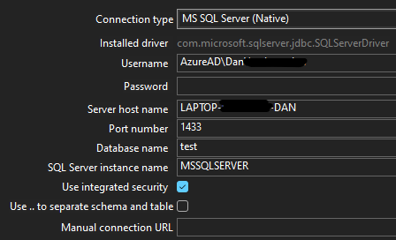
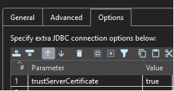
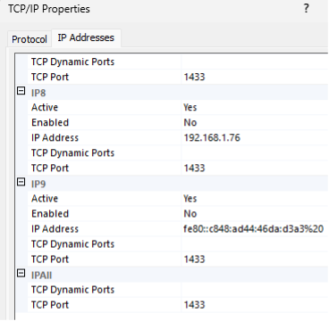

# MS SqlServer (Native)

| Option           | Info                                                                                                                                 |
| ---------------- | ------------------------------------------------------------------------------------------------------------------------------------ |
| Type             | Relational                                                                                                                           |
| Driver           | [Driver Link](https://docs.microsoft.com/en-us/sql/connect/jdbc/download-microsoft-jdbc-driver-for-sql-server?view=sql-server-ver15) |
| Version Included | 12.8.1.jre11                                                                                                                         |
| Hop Dependencies | None                                                                                                                                 |
| Documentation    | [Documentation Link](https://docs.microsoft.com/en-us/sql/connect/jdbc/setting-the-connection-properties?view=sql-server-ver15)      |
| JDBC Url         | jdbc:sqlserver://\[serverName\[\\instanceName\]\[:portNumber\]\]\[;property=value\[;property=value\]\]                               |
| Driver folder    | \<Hop Installation\>/lib/jdbc                                                                                                        |

## Integrated Authentication / Windows Based Authentication

The native Microsoft SQL JDBC driver ships with extra files that enables authentication using your current MS Windows credentials. When you download the JDBC drivers from Microsoft’s site and unzip them, there will be a directory structure like the following:

sqljdbc\_11.2\\enu\\auth\\x64 ← 64bit authentication support files.  
sqljdbc\_11.2\\enu\\auth\\x86 ← 32bit authentication support files.

**Copy the Microsoft auth dll file:**  
**From:** sqljdbc\_11.2\\enu\\auth\\x64\\mssql-jdbc\_auth-11.2.3.x64.dll  
**To:** hop\\lib\\mssql-jdbc\_auth-11.2.3.x64.dll  
**and to your Java installation folders, in my case:**  
C:\\Program Files\\Microsoft\\jdk-17.0.6.10-hotspot\\bin  
C:\\Program Files\\Microsoft\\jdk-17.0.6.10-hotspot\\lib

**Copy the JDBC driver:**  
**From:** sqljdbc\_11.2\\enu\\mssql-jdbc-11.2.3.jre11.jar  
**To:** \\hop\\plugins\\databases\\mssqlnative\\lib, replacing any version already provided.  

### Connect to relational database and JDBC drivers

  - Ensure the correct JDBC drivers are installed (see the installation section)

  - On the Metadata button, double-click the Relational Database Connection

  - **General tab:** Change the Connection type to connect to a database type

### Connect to SQL Server SQL Database

  - To connect to SQL Server first install any necessary JDBC drivers (see the Hop installation document)
    
    

    
      - If you use Integrated SQL Server, ensure that trustServerCertificate = true under Options. And possibly also encrypt = true.
    
    

  - Open metadata, and create a connection to SQL Server adding a new item under Relational Database Connection

**For local SQL Server Database (integrated security)**

  - **Connection name:** give it a name, like Local SQL Server (requires a name before it can be saved)

  - **General tab:** Change the Connection type to connect to SQL Server etc.
    
    

    
      - **Connection type:** MS SQL Server (Native)
    
      - **SQL Server instance name:** See SQL Server Configuration Manager or view Windows Services for the instance name. In most cases it is “MSSQLSERVER”
        
        

        
          - **Open SQL Server Configuration Manager:** C:\\Windows\\System32\\SQLServerManager15.msc
        
        

    
    

  - **Options tab:**

### Troubleshooting connecting to SQL Server Native via TCP/IP

<https://stackoverflow.com/questions/18841744/jdbc-connection-failed-error-tcp-ip-connection-to-host-failed>

**Open SQL Server Configuration Manager and setup TCP/IP and port 1433**

  - Open SQL Server Configuration Manager, and then expand SQL Server Network Configuration.

  - Click Protocols for InstanceName, and then make sure TCP/IP is enabled in the right panel and double-click TCP/IP.

  - On the Protocol tab, notice the value of the Listen All item.

  - Click the IP Addresses tab (image shown below): If the value of Listen All is yes, the TCP/IP port number for this instance of SQL Server is the value of the TCP Dynamic Ports item under IPAll. If the value of Listen All is no, the TCP/IP port number for this instance of SQL Server is the value of the TCP Dynamic Ports item for a specific IP address.

  - Make sure the TCP Port is 1433, click OK

  - After any changes or new settings you must restart SQLSERVER service

  - If you see that Windows SQL Server/ SQL Server Browser / SQL Server Agent service state is 'stopped', right click on SQL Server/SQL Server Browser and click start.

  - A good check I often use is to use telnet, eg on a windows command prompt run: telnet 127.0.0.1 1433
    
    

    
      - If you get a blank screen it indicates network connection established successfully, and it’s not a network problem. If you get 'Could not open connection to the host' then this is network problem
    
    

  - Alternatively, you can use netstat -a to find open and listening ports
    
    

    
      - netstat -ab | find "1433"
    
      - netstat -abn |Select-String -Pattern sql -Context 0,1
    
    

Last updated 2025-09-04 18:20:29 +0200

