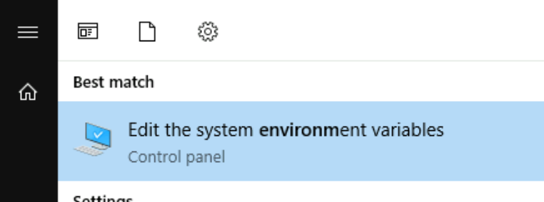
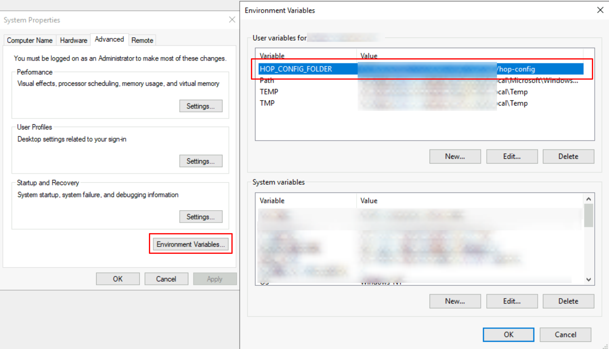

<div id="header">

# Apache Hop requirements, installation and configuration

</div>

<div id="content">

<div class="sect1">

## Overview

<div class="sectionbody">

<div class="paragraph">

The requirements and installation process for Apache Hop are intentionally kept as simple as possible.

</div>

<div class="paragraph">

This page covers everything you need to know to install and run Apache Hop on your local desktop or server, from the very basics to more advanced configurations.

</div>

<div class="paragraph">

Hop is designed to be as flexible and lightweight as possible, and is intended to blend in with your architecture, not the other way around. This makes the basic installation process extremely easy, but there’s a lot of configuration that can be applied to make Hop behave exactly the way you want it to.

</div>

<div class="admonitionblock tip">

<table>
<colgroup>
<col style="width: 50%" />
<col style="width: 50%" />
</colgroup>
<tbody>
<tr class="odd">
<td><div class="title">
Tip
</div></td>
<td>Take a look at the <a href="tech-manual::docker-container.xJkU76Vk0i">Docker</a> page for instructions to run Hop in containers and Kubernetes environments.</td>
</tr>
</tbody>
</table>

</div>

</div>

</div>

<div class="sect1">

## System Requirements

<div class="sectionbody">

<div class="paragraph">

Hop’s limited footprint should allow it to run on any modern physical or virtual machine.

</div>

<div class="paragraph">

For the default Hop distribution, a minimum of 1 CPU/core and 4GB RAM should do, even though you can tweak Hop to run on machines with even less memory.

</div>

<div class="paragraph">

Hop Runs on the following operating systems:

</div>

<div class="ulist">

  - Windows 7 or higher

  - Linux (x86\_64, ARM)

  - MacOS

  - any modern browser (Hop Web)

</div>

</div>

</div>

<div class="sect1">

## Java Runtime

<div class="sectionbody">

<div class="paragraph">

The only requirement Hop has on any supported operating system is the Java Runtime environment.

</div>

<div class="paragraph">

Apache Hop is known to work well on the following widely used Java Runtimes:

</div>

<div class="ulist">

  - [Oracle Java Runtime](https://www.java.com/)

  - [Microsoft OpenJDK](https://www.microsoft.com/openjdk) (OpenJDK builds for Windows, MacOS and Linux).

  - [OpenJDK Java Runtime](https://openjdk.java.net/install/)

</div>

<div class="paragraph">

Apache Hop works well with these 64-bit java runtimes for version 11.

</div>

<div class="paragraph">

Other Java Runtimes may work but haven’t been used and tested as extensively as the Oracle and OpenJDK JREs, so you may be pioneering. Feel free to open a [GitHub ticket](https://hop.apache.org/community/tools/#GitHub-Issues) if you run into issues, but please mention your JRE and version.

</div>

<div class="paragraph">

Run `java -version` if you’re not sure which Java version is currently installed on your system. Your output should be similar to the one shown below.

</div>

<div class="listingblock">

<div class="content">

``` highlight
openjdk version "11.0.2" 2019-01-15
OpenJDK Runtime Environment 18.9 (build 11.0.2+9)
OpenJDK 64-Bit Server VM 18.9 (build 11.0.2+9, mixed mode)
```

</div>

</div>

<div class="paragraph">

Make sure to point the `JAVA_HOME` environment variable for your operating system to your desired JRE installation. Refer to your operating system’s documentation for more information on environment variables.

</div>

</div>

</div>

<div class="sect1">

## Basic Installation

<div class="sectionbody">

<div class="paragraph">

The basic installation for Apache Hop couldn’t be easier:

</div>

<div class="ulist">

  - [download](https://hop.apache.org/download/)

  - unzip

  - change to your newly unzipped `hop` directory

  - run:
    
    <div class="ulist">
    
      - `hop-gui.bat` (Windows) or `hop-gui.sh` (Linux, MacOS): run [Hop Gui](hop-gui/index.xJkU76Vk0i)
    
      - `hop-run.bat` (Windows) or `hop-run.sh` (Linux, MacOS): [run workflows or pipelines](/hop-run/index.xJkU76Vk0i) from the command line.
    
      - `hop-server.bat` (Windows) or `hop-server.sh` (Linux, MacOS): start a [Hop Server](/hop-server/index.xJkU76Vk0i) instance.
    
    </div>

</div>

</div>

</div>

<div class="sect1">

## Set (system) environment variables

<div class="sectionbody">

<div class="paragraph">

Apache Hop’s installation and configuration are fully self-contained by default.

</div>

<div class="paragraph">

With the system or environment variables below, you can make your Hop configuration independent of the installed Hop versions. This lets you switch between Hop versions or installations, while keeping your projects and environment lists, last opened files and other settings.

</div>

<div class="admonitionblock tip">

<table>
<colgroup>
<col style="width: 50%" />
<col style="width: 50%" />
</colgroup>
<tbody>
<tr class="odd">
<td><div class="title">
Tip
</div></td>
<td>if you set the environment variables below after you’ve been using Apache Hop for a while, you can move the contents of your <code>hop/config/</code> folder to your new <code>HOP_CONFIG_FOLDER</code> location</td>
</tr>
</tbody>
</table>

</div>

<div class="sect2">

### Create environment variables in Windows

<div class="paragraph">

There are several ways to access the Environment Variables in Windows. One ways is to search for `environment variable` in the start menu and clicking the "Edit the system environment variables" link (or the corresponding entry for your local language).

</div>

<div class="paragraph">

<span class="image"></span>

</div>

<div class="paragraph">

In the dialog that pops up, click the `Environment Variables` button, then add a new `HOP_CONFIG_FOLDER` user variable and point it to the folder where you’d like to store your Apache Hop configuration. Repeat the process for any of the other variables list below you want to add to your configuration.

</div>

<div class="paragraph">

<span class="image"></span>

</div>

<div class="paragraph">

Click `Ok` to close the dialogs and (re)start Hop Gui to activate the environment variables.

</div>

</div>

<div class="sect2">

### Create environment variables in Mac OS or Linux

<div class="paragraph">

Add environment variables to your `~/.bashrc`, `~/.zshrc` or similar configuration file as shown below:

</div>

<div class="paragraph">

`export HOP_CONFIG_FOLDER=<YOUR_PREFERRED_PATH_TO_HOP_CONFIG_FOLDER>`.

</div>

<div class="paragraph">

run `source ~/.bashrc` or `source ~/.zshrc` to apply the new variables in your current session.

</div>

</div>

<div class="sect2">

### The environment variables to set

<div class="paragraph">

Unresolved directive in tmp.lQZSo9ZXhY - include::snippets/variables/hop-config-folder.adoc\[\]

</div>

<div class="paragraph">

Unresolved directive in tmp.lQZSo9ZXhY - include::snippets/variables/hop-audit-folder.adoc\[\]

</div>

<div class="paragraph">

Unresolved directive in tmp.lQZSo9ZXhY - include::snippets/variables/hop-options.adoc\[\]

</div>

<div class="paragraph">

Check the [Environment Variables](#envvars) section for more system variables that can make your life with multiple Hop versions or installations a lot easier.

</div>

</div>

</div>

</div>

<div class="sect1">

## Upgrade

<div class="sectionbody">

<div class="paragraph">

Multiple Hop versions can be installed side by side with the same process as described in the [Basic Installation](#basic).

</div>

<div class="paragraph">

Hop installations are self-contained by default, which means you’ll start with the default configuration and project and environment list with after new Hop install.

</div>

<div class="paragraph">

With the environment variables described in the previous section, all you need to do to upgrade Apache Hop next to your existing hop installation and start Hop Gui from there. Your projects and environment lists, last opened files etc should all be available.

</div>

<div class="admonitionblock tip">

<table>
<colgroup>
<col style="width: 50%" />
<col style="width: 50%" />
</colgroup>
<tbody>
<tr class="odd">
<td><div class="title">
Tip
</div></td>
<td>Apache Hop releases are tested for smooth upgrades. You can replace your existing installation when a new version is released. If you want to keep multiple Apache Hop versions around, consider renaming your unzipped <code>hop</code> folder to <code>hop-version-number</code>, e.g. <code>hop-2.5.0</code>, <code>hop-2.60</code> etc.</td>
</tr>
</tbody>
</table>

</div>

</div>

</div>

<div class="sect1">

## Additional configuration

<div class="sectionbody">

<div class="sect2">

### JVM memory settings

<div class="paragraph">

By default, Hop only sets a maximum for the JVM Heap size Hop can allocate.

</div>

<div class="paragraph">

This parameter can be changed in the `hop-gui.bat` or `hop-gui.sh` or similar scripts for `hop-run` and `hop-server`.

</div>

<div class="paragraph">

Identify the following line: `HOP_OPTIONS="-Xmx2048m"`

</div>

<div class="paragraph">

The `-Xmx` parameter determines the maximum amount of memory the JVM can allocate and can be specified in MB or GB.

</div>

<div class="paragraph">

For example:

</div>

<div class="ulist">

  - `HOP_OPTIONS=-Xmx512m`: start Hop with maximum **512MB** of memory

  - `HOP_OPTIONS=-Xmx2048m`: start Hop with maximum **2048MB** (or 2GB) of memory

  - `HOP_OPTIONS=-Xmx4g`: start Hop with maximum **4GB** of memory

</div>

<div class="paragraph">

Check the documentation for your JRE for more information about additional JVM configuration, tuning and garbage collection parameters. [This guide](https://www.baeldung.com/jvm-parameters) may help you to get started.

</div>

<div class="admonitionblock tip">

<table>
<colgroup>
<col style="width: 50%" />
<col style="width: 50%" />
</colgroup>
<tbody>
<tr class="odd">
<td><div class="title">
Tip
</div></td>
<td><strong>Developers</strong>: a couple of lines below the <code>-Xmx</code> parameter, you’ll find another <code>HOP_OPTIONS</code> line that contains <code>-Xdebug</code>. Uncomment this line to allow debuggers to attach to your running Hop instance. Check the <a href="dev-manual::setup-dev-environment.xJkU76Vk0i">developer documentation</a> for more information.</td>
</tr>
</tbody>
</table>

</div>

</div>

<div class="sect2">

### Hop environment variables

<div class="paragraph">

The following (operating system) environment variables can add a lot of flexibility to configure Hop to your exact needs.

</div>

<div class="paragraph">

Unresolved directive in tmp.lQZSo9ZXhY - include::snippets/variables/hop-audit-folder.adoc\[\]

</div>

<div class="paragraph">

Unresolved directive in tmp.lQZSo9ZXhY - include::snippets/variables/hop-config-folder.adoc\[\]

</div>

<div class="paragraph">

Unresolved directive in tmp.lQZSo9ZXhY - include::snippets/variables/hop-plugin-base-folders.adoc\[\]

</div>

<div class="paragraph">

Unresolved directive in tmp.lQZSo9ZXhY - include::snippets/variables/hop-shared-jdbc-folder.adoc\[\]

</div>

</div>

<div class="sect2">

### JDBC Drivers, Jars, Libraries, and other plugin dependencies

<div class="paragraph">

Hop comes with built-in support for tens of databases and a large number of other technologies.

</div>

<div class="paragraph">

Depending on the Apache and technology vendor’s licenses, the required libraries may not be available in the default Apache Hop distribution.

</div>

<div class="paragraph">

Download the necessary drivers or other required libraries and add them to your plugin’s `lib` directory.

</div>

<div class="paragraph">

For example, to add a JDBC driver for the MySQL database, download the MySQL JDBC jar file and add it to `<PATH>/hop/plugins/databases/mysql`.

</div>

<div class="paragraph">

Add any custom jars in `lib/core` in your Hop installation folder to make those libraries available for your entire Hop installation.

</div>

<div class="paragraph">

Add any custom jars to `plugins/transforms/janino/lib` to make them available for the User Defined Java Class transform.

</div>

</div>

<div class="sect2">

### Technology configuration

<div class="paragraph">

Hop comes with built-in support for lots of technologies that may require their own (installation and) configuration.

</div>

<div class="paragraph">

Check the [technology](technology/technology.xJkU76Vk0i) page for the platform you need to configure to find out more.

</div>

</div>

</div>

</div>

</div>

<div id="footer">

<div id="footer-text">

Last updated 2025-09-04 18:21:06 +0200

</div>

</div>
