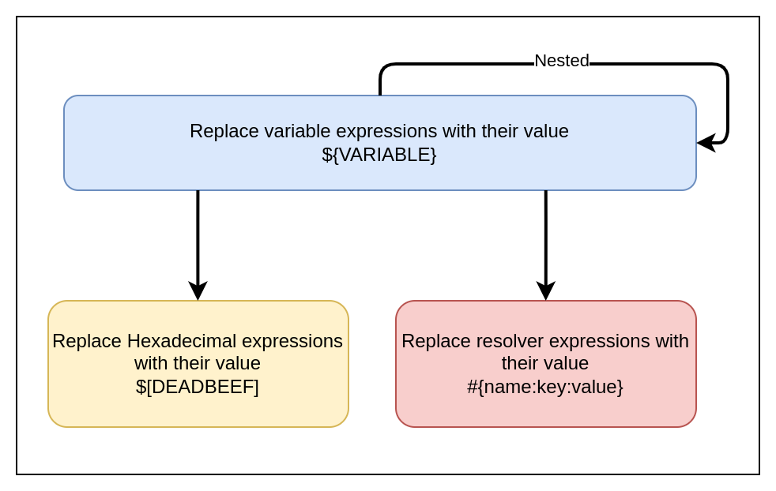
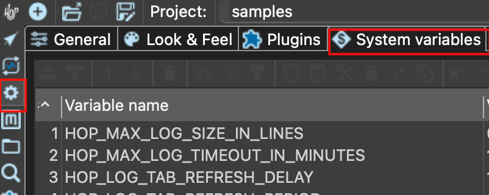

<div id="header">

# Variables

<div id="toc" class="toc">

<div id="toctitle">

Table of Contents

</div>

  - [What is a Hop variable?](#_what_is_a_hop_variable)
  - [Fields](#_fields)
  - [Parameters](#_parameters)
  - [Variables](#_variables)
  - [How do I use a variable?](#_how_do_i_use_a_variable)
  - [Hexadecimal values](#_hexadecimal_values)
  - [Variable Resolvers](#_variable_resolvers)
  - [Resolving overview](#_resolving_overview)
  - [How can I define variables?](#_how_can_i_define_variables)
  - [Locality](#_locality)
  - [Hierarchy](#_hierarchy)
  - [Parameters](#_parameters_2)
      - [System properties](#_system_properties)
      - [Environment Variables](#_environment_variables)
      - [Run Configurations](#_run_configurations)
      - [Workflow](#_workflow)
      - [Pipelines](#_pipelines)
  - [Available global variables](#_available_global_variables)
  - [Environment variables](#_environment_variables_2)
  - [Internal variables](#_internal_variables)

</div>

</div>

<div id="content">

<div class="sect1">

## What is a Hop variable?

<div class="sectionbody">

<div class="paragraph">

You don’t want to hardcode your solutions. It’s simply bad form to hardcode host names, user names, passwords, directories and so on. Variables allow your solutions to adapt to a changing environment. If for example the database server is different when developing than it is when running in production, you set it as a variable.

</div>

<div class="admonitionblock tip">

<table>
<colgroup>
<col style="width: 50%" />
<col style="width: 50%" />
</colgroup>
<tbody>
<tr class="odd">
<td><div class="title">
Tip
</div></td>
<td>Fields, parameters, and variables implicitly are available downstream if in scope. You can pass them again any number of levels, but the &quot;get parameters/variables&quot; button only retrieves from one level above.</td>
</tr>
</tbody>
</table>

</div>

</div>

</div>

<div class="sect1">

## Fields

<div class="sectionbody">

<div class="paragraph">

Fields are columns in data row(s) and are viewable in some transform field textboxes and columns and you can see the fields in scope and its value when looking at transform row results after executing a workflow/pipeline (click the little grid icon on the bottom-right of a transform to see a preview of the cached results). Field values can be passed upstream for example if you use a pipeline executor and fill in the Result rows tab and use it in conjunction with a “copy rows to result” transform in the child pipeline.

</div>

</div>

</div>

<div class="sect1">

## Parameters

<div class="sectionbody">

<div class="paragraph">

Think of parameters as function arguments, which turn into variables with the same name. When adding parameters you are basically creating MyPipeline(parameter1, parameter2,..). Parameters (e.g. in pipeline or workflow properties) need to be declared at least once in every pipeline or workflow.

</div>

<div class="paragraph">

For example, if you set parameters on a pipeline executor, the pipeline that is being called must declare the same parameter names in its pipeline properties (set to NULL if you want to inherit values). Parameters can not be “sent” upstream, but you can use a Set variables transform, but they become variables in the scope they are defined in.

</div>

<div class="paragraph">

**Explicit vs Implicit:** If you set a parameter to a default value, it becomes explicit (e.g. when editing a pipeline in pipeline properties), and it will take precedence over the same named implicit variable (a passed-in variable), but not take precedence over the same named explicit parameter. So whenever you see a transform with a column title “Parameters/Variables” that means an explicit parameter is sent to a function that will then set a variable name overriding any previous set parameter with the same name (useful if wanting to override an explicitly set param/variable in the child).

</div>

<div class="paragraph">

To change implicit parameter behaviour to explicit, you can also disable “pass all parameters” on the pipeline action. Parameters are simply variables which are explicitly defined in a workflow or pipeline to make them recognizable from outside those objects. They can also have a description and a default value.

</div>

<div class="paragraph">

You cannot combine implicit variable inheritance with explicit parameter definitions. So, if you add parameters to the pipeline definition (or to a pipeline executor) and you want it set, you must add it to the parameters tab of the child pipeline action/transform even if the same variable already exists.

</div>

<div class="paragraph">

**Advanced:** there are multiple layers in hop where you can set variables that do or do not get overwritten downstream (Java → hop environment → project → run configuration → workflow → pipeline).

</div>

</div>

</div>

<div class="sect1">

## Variables

<div class="sectionbody">

<div class="paragraph">

Variables are more global and the scope can be targeted (entire Java VM, grandparent workflow, etc.) whereas fields are the data flowing between the transforms. Local variables can be set in a pipeline but should not be used in the same pipeline as they are not thread-safe and can inherit a previous value. It is better to send or return variables to another pipeline/workflow before using them. Variables can be passed upstream if the variable was set to a larger scope. E.g.: if a variable was set in a parent with "valid in the current workflow".

</div>

<div class="paragraph">

Think of variables in 2 scopes: runtime variables and environment/workflow variables:

</div>

<div class="ulist">

  - Runtime variables – Runtime variables depend on pipeline information to generate, so they cannot be set beforehand, you need to declare those differently to be able to use them.

  - Environment/workflow variables or parameters – Environment variables/parameters are set once and used when needed in any downstream workflow/pipeline and there is no need to use Get Variables , you can refer to them directly like ${myVariable} unless you need it in a field/data stream.
    
    <div class="ulist">
    
      - E.g.: Define a parameter only once, even just in the Pipeline Executor (no need to define in receiving pipeline)
    
    </div>

</div>

<div class="paragraph">

A pipeline needs to start to get new variables. A running or nested pipeline can’t fetch new variable values. A pipeline is considered started when a pipeline starts for every row in a pipeline executor. An alternative is to use parameters.

</div>

</div>

</div>

<div class="sect1">

## How do I use a variable?

<div class="sectionbody">

<div class="paragraph">

In the Hop user interface all places where you can enter a variable have a '$' symbol to the right of the input field:

</div>

<div class="imageblock">

<div class="content">


</div>

</div>

<div class="paragraph">

You can specify a variable by referencing it between an opening `${` and a closing `}`.

</div>

<div class="listingblock">

<div class="content">

``` highlight
${VARIABLE_NAME}
```

</div>

</div>

<div class="paragraph">

Please note that in the case of a textvar (a text field that supports variables), you don’t **have** to specify a variable in these places. You can enter hard-coded values (although we advise to use variables where possible).

</div>

<div class="paragraph">

Combinations of a variable with other free-form text are also possible, like in the example below:

</div>

<div class="listingblock">

<div class="content">

``` highlight
${ENVIRONMENT_HOME}/input/source-file.txt
```

</div>

</div>

<div class="paragraph">

Unresolved directive in tmp.vhbhp3okoP - include::snippets/variables/control-space.adoc\[\]

</div>

</div>

</div>

<div class="sect1">

## Hexadecimal values

<div class="sectionbody">

<div class="paragraph">

In rare cases you might have a need to enter non-character values as separators in 'binary' text files with for example a zero byte as a separator. In those scenarios you can use a special 'variable' format:

</div>

<div class="listingblock">

<div class="content">

``` highlight
$[<hexadecimal value>]
```

</div>

</div>

<div class="paragraph">

A few examples:

</div>

| Value         | Meaning                                    |
| ------------- | ------------------------------------------ |
| `$[0D]`       | A Newline character (CR)                   |
| `$[0A]`       | A Newline character (LF)                   |
| `$[00]`       | A single byte with decimal value 0         |
| `$[FFFF]`     | Two bytes with decimal value 65535         |
| `$[CEA3]`     | The 2 bytes representing UTF-8 character Σ |
| `$[e28ca8]`   | The 3 bytes representing UTF-8 character ⌨ |
| `$[f09d849e]` | The 4 bytes representing UTF-8 character 𝄞 |

</div>

</div>

<div class="sect1">

## Variable Resolvers

<div class="sectionbody">

<div class="paragraph">

A variable resolver is a [metadata element](metadata-types/index.lE5xdaF8Q5) that allows us to find values using resolver plugins. The format to use to resolve variables using these metadata elements is the following:

</div>

<div class="listingblock">

<div class="content">

``` highlight
#{name:key:element}
```

</div>

</div>

<div class="paragraph">

For more information about how this works, go to the [Variable Resolver page](metadata-types/variable-resolver/index.lE5xdaF8Q5).

</div>

</div>

</div>

<div class="sect1">

## Resolving overview

<div class="sectionbody">

<div class="paragraph">

The following states can happen when we’re resolving variable expressions:

</div>

<div class="paragraph">

<span class="image"></span>

</div>

</div>

</div>

<div class="sect1">

## How can I define variables?

<div class="sectionbody">

<div class="paragraph">

Variables can be defined and set in all the places where it makes sense:

</div>

<div class="ulist">

  - in hop-config.json when it applies to the installation

  - in an environment configuration file when it concerns a specific lifecycle environment

  - In a [project](projects/projects-environments.lE5xdaF8Q5)

  - In a [pipeline run configuration](pipeline/pipeline-run-configurations/pipeline-run-configurations.lE5xdaF8Q5)

  - As a default parameter value in a pipeline or workflow

  - Using the [Set Variables](pipeline/transforms/setvariable.lE5xdaF8Q5) transform in a pipeline

  - Using the [Set Variables](workflow/actions/setvariables.lE5xdaF8Q5) action in a workflow

  - When executing with [Hop run](hop-run/index.lE5xdaF8Q5)

</div>

</div>

</div>

<div class="sect1">

## Locality

<div class="sectionbody">

<div class="paragraph">

Variables are local to the place where they are defined.

</div>

<div class="paragraph">

This means that setting them in a certain place means that it’s going to be inherited from that place on.

</div>

<div class="paragraph">

This also means that’s important to know where variables can be set and used and the hierarchy behind it.

</div>

</div>

</div>

<div class="sect1">

## Hierarchy

<div class="sectionbody">

| Place              | Inheritance                                                  |
| ------------------ | ------------------------------------------------------------ |
| System properties  | Inherited by the JVM and all other places in Hop             |
| Environment        | Inherited by run configurations                              |
| Run Configurations | Pipeline run configurations are inherited by the environment |
| Pipeline           | Inherited by the pipeline run configuration                  |
| Workflow           | Inherited by the workflow run configuration                  |
| Metadata objects   | Inherited by the place where it is loaded                    |

Table 1. Variables Hierarchy

</div>

</div>

<div class="sect1">

## Parameters

<div class="sectionbody">

<div class="paragraph">

Pipeline and workflows can (optionally) accept parameters.

</div>

<div class="paragraph">

Workflow and pipeline parameters are similar, and are a special type of variable that is only available within the current workflow or pipeline.

</div>

<div class="paragraph">

Workflow and pipeline parameters can have a default value and a description, and can be passed on from workflows and pipelines to other workflows and pipelines through a variety of workflow actions and pipeline transforms.

</div>

<div class="sect2">

### System properties

<div class="paragraph">

All system properties are variables that are available in all of your currently running Apache Hop instance. System properties are available as variables as well as all Java system properties.

</div>

<div class="paragraph">

System properties get set in the Java Virtual Machine that runs your Apache Hop instance. This means that you should limit yourself to only those variables which are really system specific.

</div>

<div class="paragraph">

You can add your own system variables to the ones that come with Apache Hop by default in the `System Variables` tab in the configuration perspective.

</div>

<div class="imageblock">

<div class="content">



</div>

</div>

<div class="paragraph">

These variables will be written to the `hop-config.json` file in your hop installation’s `config` folder or in your `${HOP_CONFIG_FOLDER}` location.

</div>

<div class="admonitionblock caution">

<table>
<colgroup>
<col style="width: 50%" />
<col style="width: 50%" />
</colgroup>
<tbody>
<tr class="odd">
<td><div class="title">
Caution
</div></td>
<td>even though you <em>can</em> manually change the <code>hop-config.json</code> or any of the other configuration files, you’ll rarely, if ever, need to. Only change <code>hop-config.json</code> manually if you know what you’re doing.</td>
</tr>
</tbody>
</table>

</div>

<div class="listingblock">

<div class="content">

``` highlight
{
  "systemProperties" : {
    "MY_SYSTEM_PROPERTY" : "SomeValue"
  }
}
```

</div>

</div>

<div class="paragraph">

You can also use the hop-config command line tool to define system properties:

</div>

<div class="listingblock">

<div class="content">

``` highlight
sh hop-config.sh -s MY_SYSTEM_PROPERTY=SomeValue
```

</div>

</div>

</div>

<div class="sect2">

### Environment Variables

<div class="paragraph">

You can specify variables in [project lifecycle environments](projects/index.lE5xdaF8Q5) as well.

</div>

<div class="paragraph">

This helps you configure folders and other things which are environment specific, and lets you keep a clean separation between code (your project) and configuration (your environment).

</div>

<div class="paragraph">

You can set those in the [environment settings dialog](projects/projects-environments.lE5xdaF8Q5#_create_an_environment) or using the command line:

</div>

<div class="listingblock">

<div class="content">

``` highlight
sh hop-config.sh -e MyEnvironment -em -ev VARIABLE1=value1
```

</div>

</div>

</div>

<div class="sect2">

### Run Configurations

<div class="paragraph">

You can specify variables in [pipeline run configurations](pipeline/pipeline-run-configurations/pipeline-run-configurations.lE5xdaF8Q5) and [workflow run configurations](workflow/workflow-run-configurations/workflow-run-configurations.lE5xdaF8Q5) to make a pipeline or workflow run in an engine agnostic way.

</div>

<div class="paragraph">

For example, you can have the same pipeline run on Hadoop with Spark and specify an input directory using `hdfs://` and on Google DataFlow using `gs://`

</div>

</div>

<div class="sect2">

### Workflow

<div class="paragraph">

You can define variables in a workflow either with the [Set Variables](workflow/actions/setvariables.lE5xdaF8Q5), [JavaScript](workflow/actions/eval.lE5xdaF8Q5) actions or by using parameters.

</div>

</div>

<div class="sect2">

### Pipelines

<div class="paragraph">

You can define variables in a pipeline either with the [Set Variables](pipeline/transforms/setvariable.lE5xdaF8Q5), [JavaScript](pipeline/transforms/javascript.lE5xdaF8Q5) transforms or by defining parameters.

</div>

<div class="paragraph">

**IMPORTANT** As mentioned in the [Set Variables](pipeline/transforms/setvariable.lE5xdaF8Q5) documentation page, you can’t set and use variables in the same pipeline, since all transforms in a pipeline run in parallel.

</div>

</div>

</div>

</div>

<div class="sect1">

## Available global variables

<div class="sectionbody">

<div class="paragraph">

The following variables are available in Hop through the [configuration perspective](hop-gui/perspective-configuration.lE5xdaF8Q5). If you have the menu toolbar enabled in the configuration perspective’s [General](hop-gui/perspective-configuration.lE5xdaF8Q5#_general) tab, these variables are also available through `Tools → Edit config variables`.

</div>

| Variable name                                  | Default Value | Description                                                                                                                                                                                                                                                                                                                                                                                                          |
| ---------------------------------------------- | ------------- | -------------------------------------------------------------------------------------------------------------------------------------------------------------------------------------------------------------------------------------------------------------------------------------------------------------------------------------------------------------------------------------------------------------------- |
| HOP\_AGGREGATION\_ALL\_NULLS\_ARE\_ZERO        | N             | Set this variable to Y to return 0 when all values within an aggregate are NULL. Otherwise by default a NULL is returned when all values are NULL.                                                                                                                                                                                                                                                                   |
| HOP\_AGGREGATION\_MIN\_NULL\_IS\_VALUED        | N             | Set this variable to Y to set the minimum to NULL if NULL is within an aggregate. Otherwise by default NULL is ignored by the MIN aggregate and MIN is set to the minimum value that is not NULL. See also the variable HOP\_AGGREGATION\_ALL\_NULLS\_ARE\_ZERO.                                                                                                                                                     |
| HOP\_ALLOW\_EMPTY\_FIELD\_NAMES\_AND\_TYPES    | N             | Set this variable to Y to allow your pipeline to pass 'null' fields and/or empty types.                                                                                                                                                                                                                                                                                                                              |
| HOP\_BATCHING\_ROWSET                          | N             | Set this variable to 'Y' if you want to test a more efficient batching row set.                                                                                                                                                                                                                                                                                                                                      |
| HOP\_DEFAULT\_BIGNUMBER\_FORMAT                |               | The name of the variable containing an alternative default bignumber format                                                                                                                                                                                                                                                                                                                                          |
| HOP\_DEFAULT\_BUFFER\_POLLING\_WAITTIME        | 20            | This is the default polling frequency for the transforms input buffer (in ms)                                                                                                                                                                                                                                                                                                                                        |
| HOP\_DEFAULT\_DATE\_FORMAT                     |               | The name of the variable containing an alternative default date format                                                                                                                                                                                                                                                                                                                                               |
| HOP\_DEFAULT\_INTEGER\_FORMAT                  |               | The name of the variable containing an alternative default integer format                                                                                                                                                                                                                                                                                                                                            |
| HOP\_DEFAULT\_NUMBER\_FORMAT                   |               | The name of the variable containing an alternative default number format                                                                                                                                                                                                                                                                                                                                             |
| HOP\_DEFAULT\_SERVLET\_ENCODING                |               | Defines the default encoding for servlets, leave it empty to use Java default encoding                                                                                                                                                                                                                                                                                                                               |
| HOP\_DEFAULT\_TIMESTAMP\_FORMAT                |               | The name of the variable containing an alternative default timestamp format                                                                                                                                                                                                                                                                                                                                          |
| HOP\_DISABLE\_CONSOLE\_LOGGING                 | N             | Set this variable to Y to disable standard Hop logging to the console. (stdout)                                                                                                                                                                                                                                                                                                                                      |
| HOP\_EMPTY\_STRING\_DIFFERS\_FROM\_NULL        | N             | NULL vs Empty String. If this setting is set to Y, an empty string and null are different. Otherwise they are not.                                                                                                                                                                                                                                                                                                   |
| HOP\_FILE\_OUTPUT\_MAX\_STREAM\_COUNT          | 1024          | This project variable is used by the Text File Output transform. It defines the max number of simultaneously open files within the transform. The transform will close/reopen files as necessary to insure the max is not exceeded                                                                                                                                                                                   |
| HOP\_FILE\_OUTPUT\_MAX\_STREAM\_LIFE           | 0             | This project variable is used by the Text File Output transform. It defines the max number of milliseconds between flushes of files opened by the transform.                                                                                                                                                                                                                                                         |
| HOP\_GLOBAL\_LOG\_VARIABLES\_CLEAR\_ON\_EXPORT | N             | Set this variable to N to preserve global log variables defined in pipeline / workflow Properties → Log panel. Changing it to true will clear it when export pipeline / workflow.                                                                                                                                                                                                                                    |
| HOP\_JSON\_INPUT\_INCLUDE\_NULLS               | Y             | Name of te variable to set so that Nulls are considered while parsing JSON files. If HOP\_JSON\_INPUT\_INCLUDE\_NULLS is "Y" then nulls will be included otherwise they will not be included (default behavior)                                                                                                                                                                                                      |
| HOP\_LENIENT\_STRING\_TO\_NUMBER\_CONVERSION   | N             | System wide flag to allow lenient string to number conversion for backward compatibility. If this setting is set to "Y", an string starting with digits will be converted successfully into a number. (example: 192.168.1.1 will be converted into 192 or 192.168 or 192168 depending on the decimal and grouping symbol). The default (N) will be to throw an error if non-numeric symbols are found in the string. |
| HOP\_LICENSE\_HEADER\_FILE                     | \-            | This is the name of the variable which when set should contains the path to a file which will be included in the serialization of pipelines and workflows                                                                                                                                                                                                                                                            |
| HOP\_LOG\_MARK\_MAPPINGS                       | N             | Set this variable to 'Y' to precede transform/action name in log lines with the complete path to the transform/action. Useful to perfectly identify where a problem happened in our process.                                                                                                                                                                                                                         |
| HOP\_LOG\_SIZE\_LIMIT                          | 0             | The log size limit for all pipelines and workflows that don’t have the "log size limit" property set in their respective properties.                                                                                                                                                                                                                                                                                 |
| HOP\_LOG\_TAB\_REFRESH\_DELAY                  | 1000          | The hop log tab refresh delay.                                                                                                                                                                                                                                                                                                                                                                                       |
| HOP\_LOG\_TAB\_REFRESH\_PERIOD                 | 1000          | The hop log tab refresh period.                                                                                                                                                                                                                                                                                                                                                                                      |
| HOP\_MAX\_ACTIONS\_LOGGED                      | 5000          | The maximum number of action results kept in memory for logging purposes.                                                                                                                                                                                                                                                                                                                                            |
| HOP\_MAX\_LOGGING\_REGISTRY\_SIZE              | 10000         | The maximum number of logging registry entries kept in memory for logging purposes. This is the number of logging objects, a logging object can be a pipeline/workflow/transform/action or a couple of system-level loggers.                                                                                                                                                                                         |
| HOP\_MAX\_LOG\_SIZE\_IN\_LINES                 | 0             | The maximum number of log lines that are kept internally by Hop. Set to 0 to keep all rows (default)                                                                                                                                                                                                                                                                                                                 |
| HOP\_MAX\_LOG\_TIMEOUT\_IN\_MINUTES            | 1440          | The maximum age (in minutes) of a log line while being kept internally by Hop. Set to 0 to keep all rows indefinitely (default)                                                                                                                                                                                                                                                                                      |
| HOP\_MAX\_TAB\_LENGTH                          | \-            | A variable to configure Tab size                                                                                                                                                                                                                                                                                                                                                                                     |
| HOP\_MAX\_WORKFLOW\_TRACKER\_SIZE              | 5000          | The maximum age (in minutes) of a log line while being kept internally by Hop. Set to 0 to keep all rows indefinitely (default)                                                                                                                                                                                                                                                                                      |
| HOP\_PASSWORD\_ENCODER\_PLUGIN                 | Hop           | Specifies the password encoder plugin to use by ID (Hop is the default).                                                                                                                                                                                                                                                                                                                                             |
| HOP\_PIPELINE\_ROWSET\_SIZE                    | \-            | Name of the environment variable that contains the size of the pipeline rowset size. This overwrites values that you set pipeline settings                                                                                                                                                                                                                                                                           |
| HOP\_PLUGIN\_CLASSES                           |               | A comma delimited list of classes to scan for plugin annotations                                                                                                                                                                                                                                                                                                                                                     |
| HOP\_ROWSET\_GET\_TIMEOUT                      | 50            | The name of the variable that optionally contains an alternative rowset get timeout (in ms). This only makes a difference for extremely short lived pipelines.                                                                                                                                                                                                                                                       |
| HOP\_ROWSET\_PUT\_TIMEOUT                      | 50            | The name of the variable that optionally contains an alternative rowset put timeout (in ms). This only makes a difference for extremely short lived pipelines.                                                                                                                                                                                                                                                       |
| HOP\_S3\_VFS\_PART\_SIZE                       | 5MB           | The default part size for multi-part uploads of new files to S3 (added and used by by the [AWS S3](vfs/aws-s3-vfs.lE5xdaF8Q5) VFS plugin)                                                                                                                                                                                                                                                                            |
| HOP\_SERVER\_DETECTION\_TIMER                  | \-            | The name of the variable that defines the timer used for detecting server nodes                                                                                                                                                                                                                                                                                                                                      |
| HOP\_SERVER\_JETTY\_ACCEPTORS                  |               | A variable to configure jetty option: acceptors for Hop Server                                                                                                                                                                                                                                                                                                                                                       |
| HOP\_SERVER\_JETTY\_ACCEPT\_QUEUE\_SIZE        |               | A variable to configure jetty option: acceptQueueSize for Hop Server                                                                                                                                                                                                                                                                                                                                                 |
| HOP\_SERVER\_JETTY\_RES\_MAX\_IDLE\_TIME       |               | A variable to configure jetty option: lowResourcesMaxIdleTime for Hop Server                                                                                                                                                                                                                                                                                                                                         |
| HOP\_SERVER\_OBJECT\_TIMEOUT\_MINUTES          | 1440          | This project variable will set a time-out after which waiting, completed or stopped pipelines and workflows will be automatically cleaned up. The default value is 1440 (one day).                                                                                                                                                                                                                                   |
| HOP\_SERVER\_REFRESH\_STATUS                   | \-            | A variable to configure refresh for Hop server workflow/pipeline status page                                                                                                                                                                                                                                                                                                                                         |
| HOP\_SPLIT\_FIELDS\_REMOVE\_ENCLOSURE          | N             | Set this variable to N to preserve enclosure symbol after splitting the string in the Split fields transform. Changing it to true will remove first and last enclosure symbol from the resulting string chunks.                                                                                                                                                                                                      |
| HOP\_SYSTEM\_HOSTNAME                          |               | You can use this variable to speed up hostname lookup. Hostname lookup is performed by Hop so that it is capable of logging the server on which a workflow or pipeline is executed.                                                                                                                                                                                                                                  |
| HOP\_TRANSFORM\_PERFORMANCE\_SNAPSHOT\_LIMIT   | 0             | The maximum number of transform performance snapshots to keep in memory. Set to 0 to keep all snapshots indefinitely (default)                                                                                                                                                                                                                                                                                       |
| HOP\_USE\_NATIVE\_FILE\_DIALOG                 | N             | Set this value to Y if you want to use the system file open/save dialog when browsing files                                                                                                                                                                                                                                                                                                                          |
| HOP\_ZIP\_MAX\_ENTRY\_SIZE                     | \-            | A variable to configure the maximum file size of a single zip entry                                                                                                                                                                                                                                                                                                                                                  |
| HOP\_ZIP\_MAX\_ENTRY\_SIZE\_DEFAULT\_STRING    |               |                                                                                                                                                                                                                                                                                                                                                                                                                      |
| HOP\_ZIP\_MAX\_TEXT\_SIZE                      | \-            | A variable to configure the maximum number of characters of text that are extracted before an exception is thrown during extracting text from documents                                                                                                                                                                                                                                                              |
| HOP\_ZIP\_MAX\_TEXT\_SIZE\_DEFAULT\_STRING     | \-            |                                                                                                                                                                                                                                                                                                                                                                                                                      |
| HOP\_ZIP\_MIN\_INFLATE\_RATIO                  | \-            | A variable to configure the minimum allowed ratio between de- and inflated bytes to detect a zipbomb                                                                                                                                                                                                                                                                                                                 |
| HOP\_ZIP\_MIN\_INFLATE\_RATIO\_DEFAULT\_STRING | \-            |                                                                                                                                                                                                                                                                                                                                                                                                                      |
| NEO4J\_LOGGING\_CONNECTION                     |               | Set this variable to the name of an existing Neo4j connection to enable execution logging to a Neo4j database.                                                                                                                                                                                                                                                                                                       |

</div>

</div>

<div class="sect1">

## Environment variables

<div class="sectionbody">

<div class="paragraph">

Set the environment variables listed below in your operating system to configure Hop’s startup behavior:

</div>

<div class="paragraph">

Unresolved directive in tmp.vhbhp3okoP - include::snippets/variables/hop-audit-folder.adoc\[\]

</div>

<div class="paragraph">

Unresolved directive in tmp.vhbhp3okoP - include::snippets/variables/hop-config-folder.adoc\[\]

</div>

<div class="paragraph">

Unresolved directive in tmp.vhbhp3okoP - include::snippets/variables/hop-plugin-base-folders.adoc\[\]

</div>

<div class="paragraph">

Unresolved directive in tmp.vhbhp3okoP - include::snippets/variables/hop-shared-jdbc-folder.adoc\[\]

</div>

<div class="paragraph">

Additionally, the following environment variables can help you to add even more fine-grained configuration for your Apache Hop installation:

</div>

| Variable                   | Default | Description                                                                                      |
| -------------------------- | ------- | ------------------------------------------------------------------------------------------------ |
| HOP\_AUTO\_CREATE\_CONFIG  | N       | Set this variable to 'Y' to automatically create config file when it’s missing.                  |
| HOP\_METADATA\_FOLDER      | \-      | The system environment variable pointing to the alternative location for the Hop metadata folder |
| HOP\_REDIRECT\_STDERR      | N       | Set this variable to Y to redirect stderr to Hop logging.                                        |
| HOP\_REDIRECT\_STDOUT      | N       | Set this variable to Y to redirect stdout to Hop logging.                                        |
| HOP\_SIMPLE\_STACK\_TRACES | N       | System wide flag to log stack traces in a simpler, more human-readable format                    |

</div>

</div>

<div class="sect1">

## Internal variables

<div class="sectionbody">

| Variable                                | Default | Description                                                                                                                                                                                                                         |
| --------------------------------------- | ------- | ----------------------------------------------------------------------------------------------------------------------------------------------------------------------------------------------------------------------------------- |
| ${Internal.Workflow.Filename.Folder}    | N       | The full directory path (folder) where the current workflow (.hwf) file is stored. This is useful for dynamically referencing the location of workflow files, especially when working across different environments or directories. |
| ${Internal.Workflow.Filename.Name}      | N       | The name of the current workflow file (.hwf) without the folder path or extension. Useful for logging or dynamically referencing the workflow name in tasks.                                                                        |
| ${Internal.Workflow.Name}               | N       | The name of the current workflow as defined within the project, not the filename. This can be used to document or log workflow execution dynamically.                                                                               |
| ${Internal.Workflow.ID}                 | N       | The unique ID of the current workflow execution. Useful for tracking execution instances in logs or within dynamic workflows.                                                                                                       |
| ${Internal.Workflow.ParentID}           | N       | The unique ID of the parent workflow if the current workflow was started by another workflow. This is helpful for tracing parent-child workflow relationships in logging.                                                           |
| ${Internal.Entry.Current.Folder}        | N       | The folder where the currently running action (entry) resides. Useful for organizing logs or resources dynamically based on where actions are executed from.                                                                        |
| ${Internal.Pipeline.Filename.Directory} | N       | The full directory path where the current pipeline (.hpl) file is located. Useful when building dynamic file paths or organizing files relative to the pipeline.                                                                    |
| ${Internal.Pipeline.Filename.Name}      | N       | The name of the current pipeline file (.hpl) without the folder path or extension. Useful for logging or referencing the pipeline name in scripts and configuration.                                                                |
| ${Internal.Pipeline.Name}               | N       | The name of the current pipeline as defined within the project. This can be used for tracking or logging pipeline executions dynamically.                                                                                           |
| ${Internal.Pipeline.ID}                 | N       | The unique ID of the current pipeline execution. This ID is useful for referencing and tracking execution instances in logs or external systems.                                                                                    |
| ${Internal.Pipeline.ParentID}           | N       | The unique ID of the parent pipeline if the current pipeline was started by another pipeline. Useful for tracking parent-child relationships between pipelines.                                                                     |
| ${Internal.Transform.Partition.ID}      | N       | The ID of the partition in a partitioned transform. It allows users to track or log data partitions during parallel processing.                                                                                                     |
| ${Internal.Transform.Partition.Number}  | N       | The partition number for partitioned processing in a transform. This is useful for distributing data processing tasks across multiple instances.                                                                                    |
| ${Internal.Transform.Name}              | N       | The name of the currently executing transform within a pipeline. It helps in logging and identifying which transform is performing certain actions during execution.                                                                |
| ${Internal.Transform.CopyNr}            | N       | The number of the transform copy that is executing. When transforms are run in parallel, this variable helps differentiate between the instances of the transform.                                                                  |
| ${Internal.Transform.ID}                | N       | The unique ID of the transform instance. Useful for tracking transform execution and debugging.                                                                                                                                     |
| ${Internal.Transform.BundleNr}          | N       | The bundle number for partitioned execution, helpful in load-balancing or distributing data across partitions.                                                                                                                      |
| ${Internal.Action.ID}                   | N       | The unique ID of the current action (entry) in a workflow. Useful for tracking specific actions within a larger workflow.                                                                                                           |

</div>

</div>

</div>

<div id="footer">

<div id="footer-text">

Last updated 2025-09-04 18:23:55 +0200

</div>

</div>
